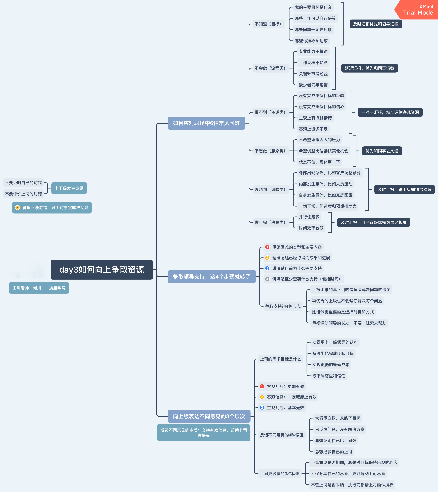

# 插座学院-职场进阶

转变思维：从解决问题到定义问题
管理不追求规范，管理不谈对错，只面对事实解决问题

给领导汇报工作，领导态度不明确的原因：
1.领导并不知道如何制定目标
2.领导不想干预具体的工资目标
3.领导事情多，造成决策疲劳
4.这件事在领导的优先级低
解决方案：
1.向直属领导请示经营目标
2.请直属领导授权自己制定目标
3.请直属领导确认制定的工作目标

管理首先是决定做什么，然后决定谁来做的过程

跳槽不是为了换份工作，而是为了寻找职场资源，完成下一个个人目标

不同层级的管理者负责什么
基层管理：抓业绩，必须懂计划，懂客户
中层管理：抓效率，必须懂流程，懂文化
高层管理：抓战略，必须懂组织，懂变革

定目标 -- 配资源 -- 做流程 -- 抓进展 -- 拿成果 -- 给评价

目标管理的3个普遍问题：
目标不清晰，目标无效，目标没有承诺

晋升的两种思维
创始人思维（创造空间） & 经理人思维（等待空间）

升值加薪的根本前提：
不仅有能力，更要有意愿，承担更大的责任和更高的目标。
意愿甚至比能力还重要，意愿关乎信任，信任决定资源分配

管理的价值：
发现机会，提升团队，业绩增长，同业领先

上司的职责：
1.带领团队完成上级交代的经营性目标
2.为下属制定工作计划，提升下属工作效率
3.为团队争取和提供资源，帮助团队解决问题
4.培养和选拔优秀人才（加班人）

争取支持的4个步骤
1.明确困难的类型和主要内容
2.精准阐述已经取得的成果和进展
3.讲清楚目前为什么需要支持
4.讲清楚至少需要什么支持（包括时间，人力，物力，财力，技术等）

上级的需求目标是什么？
1.获取更上一级领导的认可
2.持续出色的完成团队目标
3.实现更低的管理成本
4.被下属尊重和信任

不要证明自己的对错，不要评价上司的对错

反馈不同意见的4中误区：反馈不同意见的本质：交换有效信息，帮助上司做决策
1.太看重立场，忽略了目标
2.只反馈问题，没有解决方案
3.总想着证明自己比上司强
4.总想拯救自己的上司

上司更欣赏的3中状态
1.不管意见是否相同，总能对目标保持乐观的心态
2.不仅分享自己的思考，更能调动上司的思考
3.不管上司是否采纳，执行前都请上司确认授权

