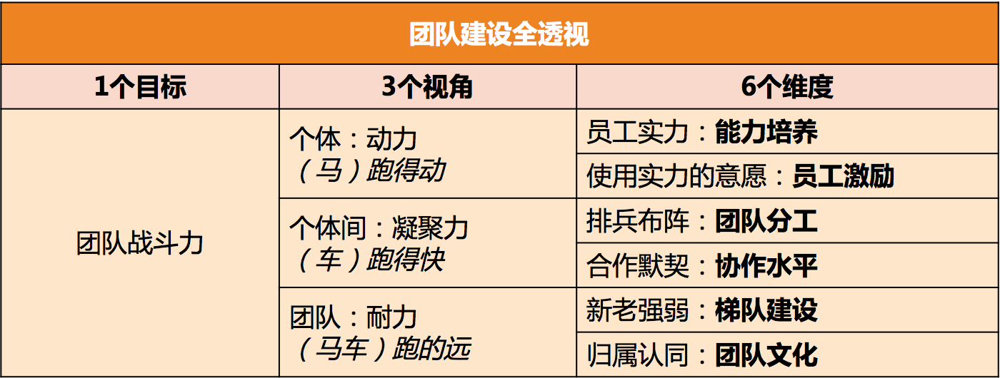


## 管理规划四要素
>1.职能：你和团队是干什么的  
>2.目标：你想要干什么，要带领团队去哪里，上级领导的期望  
>3.团队：你依靠什么样的团队去完成目标  
>4.路径：你要选择走哪条路去达到目标，以及投入什么资源  

只有你及你的团队成员都非常清楚团队的职能定位时，才能收到如下的这些效果。  
>1.大家都知道自己是做什么的，同时，知道做什么对于团队来说非常重要。  
>2.大家都很容易去主动思考，要提升哪方面的能力，对团队来说是最有帮助的。  
>3.大家更容易理解自己工作的价值和意义，从而增强对团队的认同度和归属感。  

职责，是团队职能的下限，即，至少要完成的工作，如果这些职责都搞不定，意味着团队的基本价值都不能体现.  
使命，是团队职能的上限，即，如果我们团队做得好，就能承担更大的职责，体现出更大的价值.  

基本职责解决的是“团队生存”问题，而使命解决的是“团队幸福”问题。对于有的人来说，看不到幸福的希望，则生存也将失去意义。  

## 团队建设

## 提升员工个人能力  
### 推，就是给压力，推着他们学。
>1.提出明确的工作要求。比如，在1周内熟悉某个业务并可以做开发。  
>2.设置学习机制。也就是强制要求遵守学习规则，并完成学习任务。  
>3.peer pressure。团队整体学习成长的氛围，会给不学习的员工带来压力。  
>4.惩罚。包括从绩效等级、晋升机会、调薪幅度等等，对于学习意愿低的员工有适当的“关照”。  
### 拉，就是给方向，引导他们学。
>1.树立榜样。把特别有学习意愿和成长快速的员工设为标杆人物，在团队内给予认可和奖励。  
>2.配备导师。有明确导师的新人和员工，更愿意请教问题并快速融入团队。请为你团队成员配备导师，新人导师最好是团队内的，而资深员工的导师，可以找团队外更资深的人。  
>3.给地图。成熟的公司往往会有技术方面的“技能图”，作为管理者，你也可以为自己团队制定一个成长的“技能图”，并标记出重要等级。这样，团队成员就有了学习和成长的方向，知道该往哪里使劲了。  
### 放手，就是给发挥空间，让他们自主学习。
>1.给员工勇挑重担的机会。在风险可控的情况下，给员工承担责任的机会，让他们去负责一些有挑战的工作。  
>2.给员工自主空间，让他们独立思考，独立决策。你的辅导仅限于在他们的决策之后给出看法和建议。  
>3.给员工信心和耐心，允许他们犯错、走弯路。因为很多经验都是踩坑儿踩出来的，所以不能一出问题就劈头盖脸一顿批，甚至是剥夺其做事的机会。  

## 提升员工工作意愿和积极性
>1.奖励要具体，公开，及时  
>2.提升员工工作的自主性(工作地点，时间，方法的自主性)  
>3.提升员工专精度，持续成长(发挥员工的个人优势)  
>4.激励要立体，激励在平时，激励要设计(因团队构成不同，因人而异)

## 物色和培养核心人才
梯队建设：梯队规划和梯队培养  
和你相似的人才是人才，和你互补的人才是更宝贵的人才。强调行为风格和思维方式的多样性(多元)  

定计划-定期检查-总结

