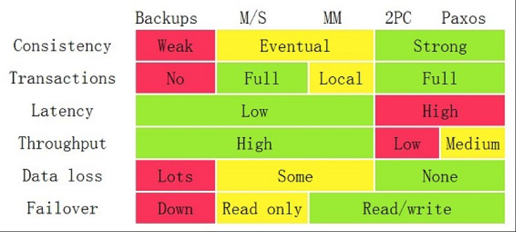

[https://coolshell.cn/articles/10910.html]

Backup
Master/Slave 
双(多)Master
2/3PC
Paxos

CAP
CA  2PC     不容许网络错误
AP  Gossip  一致性差
CP  Paxos   少数的结点会在没有同步到最新版本的数据时变成不可用的状态

Amazon Dynamo的NWR模型. 
所谓NWR模型。N代表N个备份，W代表要写入至少W份才认为成功，R表示至少读取R个备份。配置的时候要求W+R > N。 因为W+R > N，
 所以 R > N-W 这个是什么意思呢？就是读取的份数一定要比总备份数减去确保写成功的倍数的差值要大。

也就是说，每次读取，都至少读取到一个最新的版本。从而不会读到一份旧数据。当我们需要高可写的环境的时候，我们可以配置W = 1 如果N=3 那么R = 3。 
这个时候只要写任何节点成功就认为成功，但是读的时候必须从所有的节点都读出数据。如果我们要求读的高效率，我们可以配置 W=N R=1。
这个时候任何一个节点读成功就认为成功，但是写的时候必须写所有三个节点成功才认为成功。

NWR模型的一些设置会造成脏数据的问题，因为这很明显不是像Paxos一样是一个强一致的东西，所以，可能每次的读写操作都不在同一个结点上，
于是会出现一些结点上的数据并不是最新版本，但却进行了最新的操作。

所以，Amazon Dynamo引了数据版本的设计。也就是说，如果你读出来数据的版本是v1，当你计算完成后要回填数据后，
却发现数据的版本号已经被人更新成了v2，那么服务器就会拒绝你。版本这个事就像“乐观锁”一样。

Amazon的Dynamo把版本冲突这个问题巧妙地回避掉了——版本冲这个事交给用户自己来处理。

