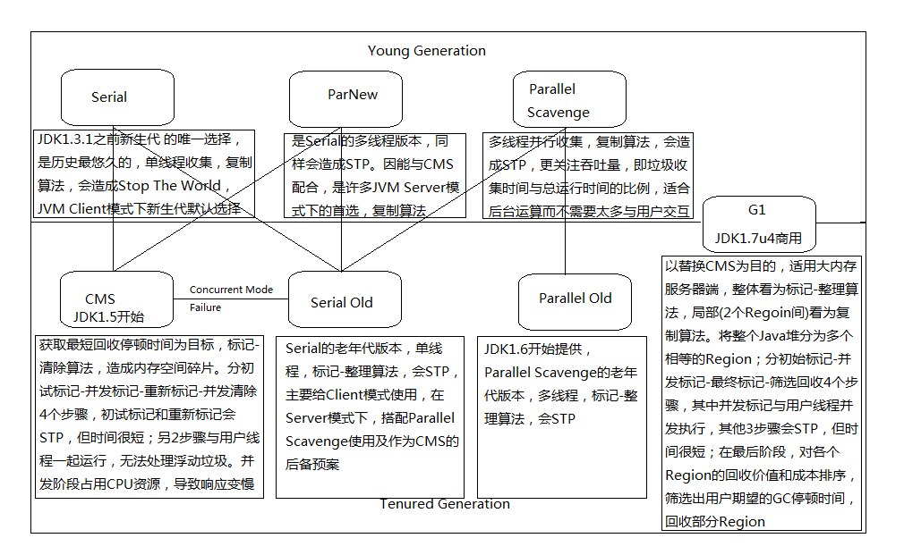

# 垃圾的定义
1.可达性分析算法：通过一系列称为“GC Roots”的对象作为起始点，从这些节点开始向下搜索，搜索所走过的路径称为引用链“Reference Chain”，
当一个对象到GC Roots没有任何的引用链相连时，证明该对象可回收。  
    可作为GC Roots的对象一般为：
>1.虚拟机栈中（栈帧中的本地变量表）引用的对象；  
>2.方法区中类的静态属性引用的对象；  
>3.方法区中常量引用的对象；  
>4.本地方法栈JNI（一般指native方法）中引用的对象。  

2.引用计数算法：每当有一个地方引用它时，计数器加1；当引用失效时，计数器减1。最终在计数器为0的时候，即可回收。该算法简单高效，但无法解决对象循环引用的问题。

目前主流商业的JVM，大部分采用可达性分析算法判断对象是否存活。

安全点：在GC时，需要用户线程执行到安全点时就暂停用户线程，等待GC线程完成GC后在继续执行（STW Stop The World）。
暂停用户线程有抢占式和主动式暂停。现在一般采用主动式：即GC线程在需要GC时，设置一个需要GC的标志位，用户线程在每达到一个安全点时，主动去检查GC标志，如果发现需要GC，则主动暂停，等待GC完成。

## 
目前的GC回收器简介
