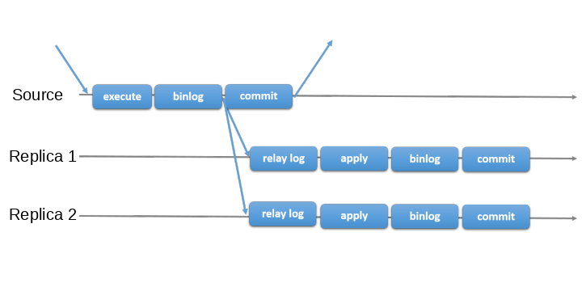
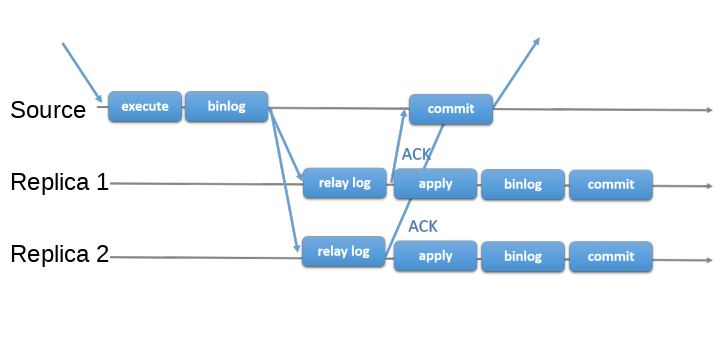

# MySQL5.7新出的同步方案
[https://dev.mysql.com/doc/refman/5.7/en/group-replication.html]  

## 异步复制



## 半同步复制



## 组复制(Group Replication) 
MySQL 5.7.17及更高版本内置该插件

使用paxos为一致性协议，一个组最少需要3个实例，最多9个  
目前仅支持InnoDB引擎，可使用 `disabled_storage_engines="MyISAM,BLACKHOLE,FEDERATED,ARCHIVE,MEMORY"`禁用其他引擎  

```shell script
server_id=1
gtid_mode=ON
enforce_gtid_consistency=ON
master_info_repository=TABLE
relay_log_info_repository=TABLE
binlog_checksum=NONE
log_slave_updates=ON
log_bin=binlog
binlog_format=ROW
```
这些设置将服务器配置为使用唯一标识符1，以启用全局事务标识符并将复制元数据存储在系统表中而不是文件中。此外，它指示服务器打开二进制日志记录，使用基于行的格式并禁用二进制日志事件校验和  

```shell script
plugin_load_add='group_replication.so'
transaction_write_set_extraction=XXHASH64
group_replication_group_name="aaaaaaaa-aaaa-aaaa-aaaa-aaaaaaaaaaaa"
group_replication_start_on_boot=off
group_replication_local_address= "s1:33061"
group_replication_group_seeds= "s1:33061,s2:33061,s3:33061"
group_replication_bootstrap_group=off
```


